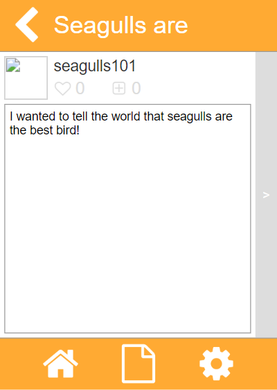

# SMST

SMST (Social Media Service Test) was an app I created for my APCSP create task.
While I could have made a simpler project in a format I was more comfortable with,
I wanted to experiment with AppLab's data system and wanted to pursue this interesting
idea I had (which was inspired by my previous side project [\[c\]chat](https://github.com/justinhschaaf/apcsp/tree/master/[c]chat).

SMST allowed users to create an account, create posts, like and save, set your avatar, delete your data, and delete your account.
To prevent users from entering actual passwords, a 5-word secret phrase was automatically generated from a [list of words](https://www.usingenglish.com/resources/wordcheck/list-basic+english.html). Each user and post would be given a unique ID generated from a list of letters and numbers. On their home page, users could view posts chronologically, by likes, and by saves. I felt like this app did many things for being made with AppLab, and I got it done in the 12 hours of class time we were provided with to work.

You can find the original project [here](https://studio.code.org/projects/applab/sO5IL1lW8awQCjv7I1uMArMS7PBTBJGS8HvNBVBO6D8). Be responsible. Also, I'm not resetting your password if you lose it.
